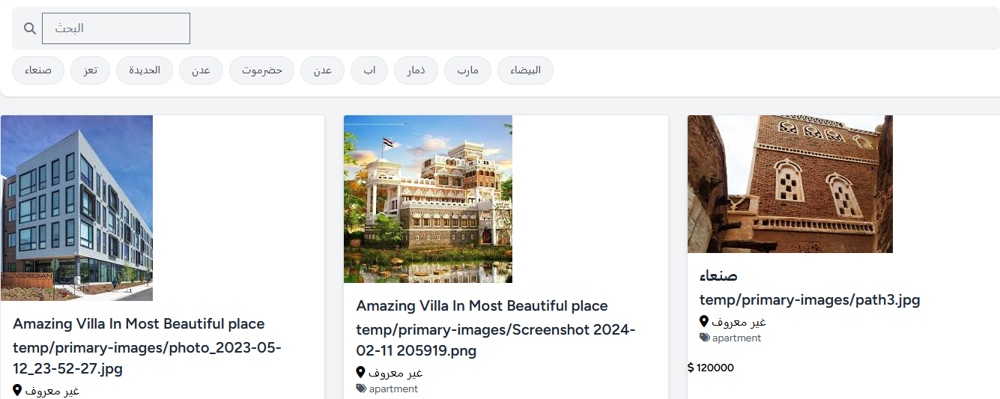
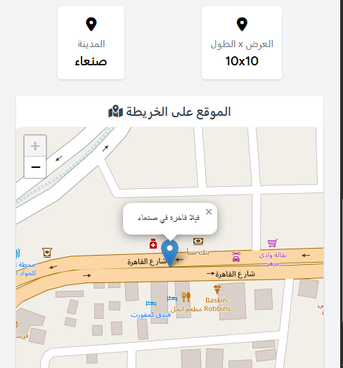

# 🏠 Property Services Web Platform  - Laravel + Livewire + Filament + Tailwind

نظام عقاري احترافي مبني باستخدام  Laravel 10 وLivewire ,Filament Admin , tailwindيمكّن المستخدمين من تأجير أو بيع العقارات مع واجهات جذابة ودعم للخرائط والصور، ,وصلاحيات مخصصة لكل من المالك والمستأجر والإدارة . لا زال في مرح. 
 
---

## 🚀 الميزات الرئيسية

- 🔑 تسجيل دخول مخصص (مالك، مستأجر، زائر)
- 🏠 إضافة وتصفح العقارات (شقق، فلل، محلات، مباني)
- 🗺️ تحديد الموقع من خلال الخريطة (Leaflet.js)
- 📸 رفع صور للعقار مع عرض سلايدر جذّاب
- 🗃️ لوحة إدارة متقدمة باستخدام Filament
- 🔎 فلاتر وتصنيفات حسب المدينة، المنطقة، النوع، السعر
- 💳 دعم الدفع الإلكتروني (Stripe)
- 📊 تقارير وعدادات للإدارة والمالكين

---

## 🖼️ صور من الواجهة
## Tanant Landing Page


### 🎯  Admin قائمة العقارات الخاص ب :

.png)

.png)

### 📍 تحديد الموقع على الخريطة:


## responsive  for phones


---
---

## ⚙️ التثبيت

```bash
git clone https://github.com/Ajabaagaya/Properties-Services-Web-App-
cd real-estate-platform

composer install
cp .env.example .env
php artisan key:generate

# إعداد قاعدة البيانات
php artisan migrate --seed

# إعداد روابط التخزين
php artisan storage:link

# تثبيت npm (لـ Livewire / Filament)
npm install && npm run build
```

---

## 👤 أنواع المستخدمين

| النوع       | صلاحيات                                                |
|-------------|---------------------------------------------------------|
| 🔑 Admin    | إدارة كافة العقارات والمستخدمين والتقارير             |
| 🏠 Owner    | إضافة عقارات، متابعة الحجزات، الرد على المستأجرين     |
| 👤 Tenant   | تصفح، حجز، وطلب معلومات عن العقارات                   |

---

## 🌍 نظام الخرائط

- يعتمد على [Leaflet.js](https://leafletjs.com) مفتوح المصدر.
- يتم تحديد إحداثيات العقار يدويًا عبر اختيار الموقع من الخريطة.
- تُحفظ الإحداثيات تلقائيًا داخل قاعدة البيانات.

---

## 📦 المتطلبات

- PHP >= 8.1
- Laravel >= 10.x
- MySQL أو PostgreSQL
- Node.js >= 16
- Composer

---

## 📄 الرخصة

هذا المشروع مرخص تحت [MIT License](LICENSE).
